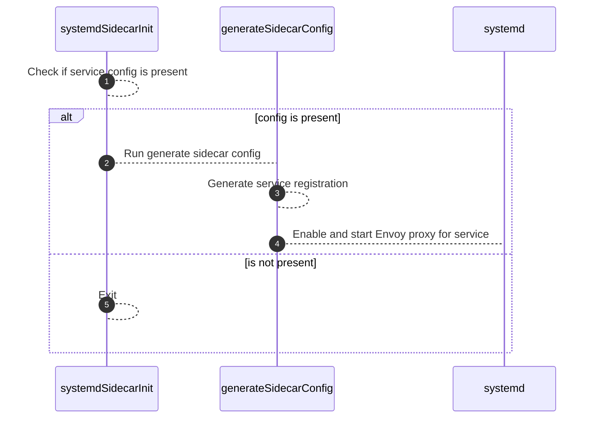

# Ansible Collection - blake.consul

The Ansible Consul collection includes a variety of Ansible roles to help manage
the installation and configuration of a Consul datacenter.

**Note:** This collection is still in active development. There may be unidentified issues as development continues.

## Included Content

The current stable release (`0.1.1`) of the Ansible Consul collection includes
the following roles:

|Name|Description|
|----|-----------|
|[transparent_proxy](https://github.com/blake/ansible-collection-consul/blob/main/roles/transparent_proxy)|Configure a VM in Consul service mesh with transparent proxying|

## Requirements

This collection has been developed and tested with
[maintained](https://docs.ansible.com/ansible/devel/reference_appendices/release_and_maintenance.html)
versions of Ansible, specifically `2.11.2`. Backwards compatibility is not guaranteed.

Instructions on how to install Ansible can be found in the [Ansible website](https://docs.ansible.com/ansible/latest/installation_guide/intro_installation.html).

## Installation

### Ansible Galaxy

Use `ansible-galaxy collection install git+https://github.com/blake/ansible-collection-consul.git,v0.1.1`
to install the latest stable release of the collection on your system.

You can also include the collection in a `requirements.yml` file and install it
via `ansible-galaxy collection install --requirements-file requirements.yml`,
using the format:

```yaml
---
collections:
  - name: https://github.com/blake/ansible-collection-consul.git
    type: git
    version: v0.1.1
```

### Git

Use `git clone https://github.com/blake/ansible-collection-consul.git` to pull
the latest edge commit of the collection from GitHub.

## Usage

Sample playbooks for each use case covered by this collection can be found in
the [`playbooks/`](https://github.com/blake/ansible-collection-consul/blob/main/playbooks/) folder in the following files:

|Name|Description|
|----|-----------|
|**[`install-consul-envoy.yaml`](https://github.com/blake/ansible-collection-consul/blob/main/playbooks/install-consul-envoy.yaml)**|Install Consul and Envoy with transparent proxy config|

### OS startup procedure with `transparent_proxy`

The transparent proxy role installs a number of packages onto the operating
system image that facilitate starting a VM with transparent proxy enabled for
the installed application. These applications include [cloud-init], [Consul],
[Envoy], and several supporting scripts.

Cloud-init is configured to run on system startup. The expectation is that the
operator will use cloud-init to inject a service configuration file at
`/srv/consul/service-config.json` that signifies the VM should be configured to
run Consul and Envoy for a local application. The service configuration file
contains a JSON dict with various annotations that specify details of the service
to add to the mesh, such as the service name, port for the local application,
proxy mode (`direct` or `transparent` (default)), or other supported parameters.

The `consul-sidecar-init` systemd oneshot service is configured to run after
cloud-init successfully exits. If the `consul-sidecar-init` service detects that
`/srv/consul/service-config.json` is present, that systemd service will execute
`/srv/consul/generate-sidecar-configs.py`.

`generate-sidecar-configs` will generate a Consul service registration based on
the parameters defined in the service config, and place the resultant file into
`/etc/consul.d/service-registration.json`. Lastly, it will enable and start the
Envoy proxy for the service using the `envoy@.service` unit template file.



## License

[Apache License, Version 2.0](https://github.com/blake/ansible-collection-consul/blob/main/LICENSE)

## Author Information

[Blake Covarrubias](https://github.com/blake)

<!-- Reference style markdown links -->
[cloud-init]: https://cloudinit.readthedocs.io
[Consul]: https://www.consul.io/
[Envoy]: https://www.envoyproxy.io/
